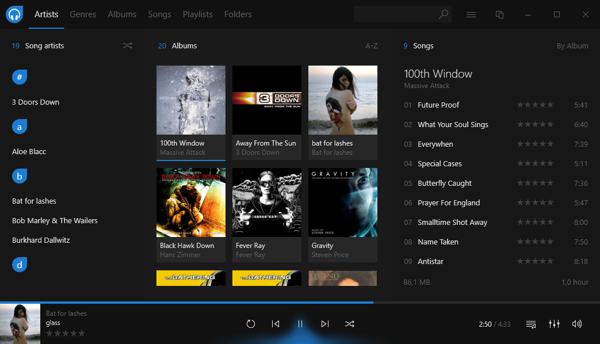

# Dopamine (for Windows)

Dopamine is an audio player which tries to make organizing and listening to music as simple and pretty as possible. It is written in C# and is powered by the [CSCore sound library](https://github.com/filoe/cscore).

More information and downloads are available at [https://www.digimezzo.com](http://www.digimezzo.com).

This software uses code of <a href=http://ffmpeg.org>FFmpeg</a> licensed under the <a href=http://www.gnu.org/licenses/old-licenses/lgpl-2.1.html>LGPLv2.1</a> and its source can be downloaded <a href=https://github.com/FFmpeg/FFmpeg>here</a>.

## Compile instructions ##

The Dopamine source code has a dependency to file **Windows.winmd**, which is provided by the Windows 10 SDK (for the system notifications). Install the Windows 10 SDK for your version of Windows 10. For Windows 10 10.0.17134.0, Windows.winmd can be found in the folder **C:\Program Files (x86)\Windows Kits\10\UnionMetadata\10.0.17134.0**. You'll have to copy this file to its parent folder. So it is available in this path: **C:\Program Files (x86)\Windows Kits\10\UnionMetadata\Windows.winmd**.

The Dopamine source code also has a dependency to file **C:\Program Files (x86)\Reference Assemblies\Microsoft\Framework\.NETCore\v4.5\System.Runtime.WindowsRuntime.dll**. Make sure it is available on your computer.

If both dependencies are met, Dopamine should compile without issues on Windows 7, 8, 8.1 and 10.

If you are still unable to find assembly **Windows** after following these steps, please check issue <a href="https://github.com/digimezzo/dopamine-windows/issues/836">#836</a> for more help finding it.

## Helping out with translations ##

Currently, I'm getting language files via Facebook, Twitter, e-mail and GitHub. It's getting hard to keep track of them and translations get lost. I'd like to centralize translation contributions on GitHub. The instruction below should help you do this.

The most up to date translation files can be found in this repository, <a href="https://github.com/digimezzo/dopamine-windows/tree/master/Dopamine/Languages">over here</a>.

For existing translation files, please edit them directly on GitHub and send me a pull request. <a href="https://help.github.com/articles/editing-files-in-another-user-s-repository/">Editing files in another user's repository</a> explains how to do this.

For new translation files (which are not yet in the repository), please add them via pull request. If you don't know how to add them, send me an e-mail to inform me which language you'd like me to add. I'll add the language file to the repository, so you can edit it directly on GitHub following the above procedure.
